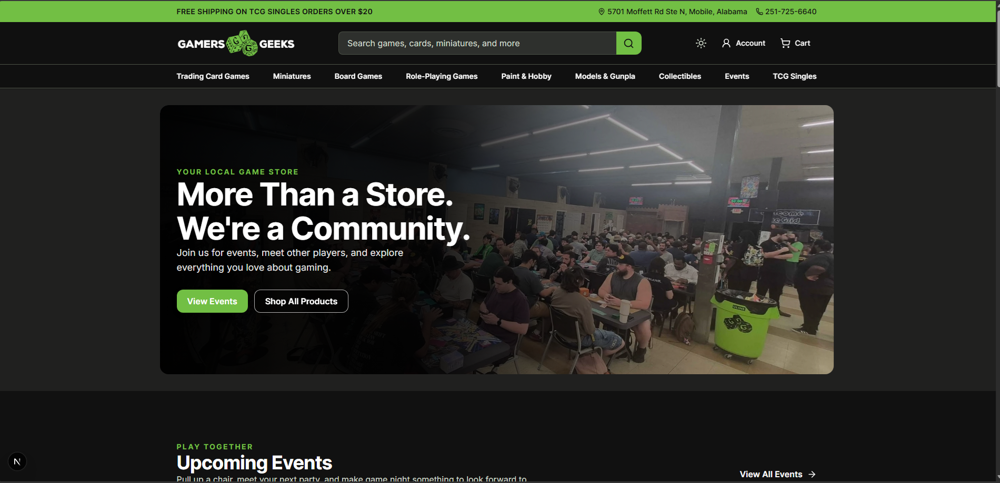
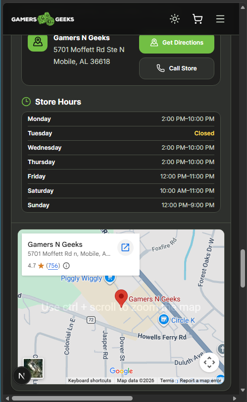

<p align="center">
  <picture>
    <source media="(prefers-color-scheme: dark)" srcset="./assets/branding/logos/gng_logo_nooutline-original-DARKMODE.png">
    <source media="(prefers-color-scheme: light)" srcset="./assets/branding/logos/gng_logo_nooutline-original.png">
    
  </picture>
</p>

# Gamers N Geeks Modern Website Redesign

> A responsive Next.js storefront redesign concept focused on usability, accessibility, performance, and a Shopify-ready migration path.

<p align="center">
  <a href="https://gng.davidtroi.com">
    
  </a>
  <a href="https://gng-concept.vercel.app">
    
  </a>
  
  
  
  
  
</p>

---

## Overview

This repository contains an independent interactive redesign concept for **Gamers N Geeks**, a local game store in Mobile, Alabama.

The project explores how a modern customer-facing experience could sit in front of the store's existing commerce ecosystem without replacing the business systems that already work. The demo uses local/mock data so the UX can be developed and evaluated independently from production Shopify, inventory, payment, customer, and event systems.

The result is a portfolio case study covering:

- responsive UI development
- reusable React component architecture
- TypeScript-based data models
- mobile-first navigation
- accessibility-conscious interaction patterns
- performance-minded image and rendering choices
- design-system documentation
- migration and rollback planning
- deployment to Vercel

> **Live demo:** https://gng.davidtroi.com  
> **Fallback:** https://gng-concept.vercel.app

---

## What the Demo Includes

The current demo includes:

- responsive homepage experience
- desktop and mobile navigation
- light/dark theme support
- featured categories and products
- event discovery
- product and collection page concepts
- store information and contact experience
- reusable UI components
- custom 404 experience
- Vercel Analytics and Speed Insights
- responsive desktop and mobile presentation assets

Production integrations such as live Shopify inventory, checkout, customer accounts, event registration, newsletter delivery, and social feeds are intentionally outside this demo's scope.

---

## Screenshots

### Desktop



### Mobile



---

## Architecture

The project separates application code, source assets, documentation, and presentation deliverables:

```text
GamersNGeeksDEMO/
├── app/
│   ├── public/
│   └── src/
│       ├── app/
│       ├── components/
│       └── lib/
├── assets/
├── deliverables/
└── docs/
```

Shared interface elements are split into layout, section, theme, and reusable UI components. Demo content is represented through typed local data modules so production data sources can later replace mock data without requiring a full UI rewrite.

See [ARCHITECTURE.md](./docs/ARCHITECTURE.md) for the design and development conventions used by the project.

---

## Technical Highlights

### Responsive component system

Reusable layout and UI primitives support desktop and mobile experiences while keeping page-level code focused on composition rather than repeated markup.

### Typed demo data

Products, events, categories, store information, and other content are represented with TypeScript types and structured data modules.

### Theme architecture

Theme behavior uses semantic design tokens, CSS variables, OS preference detection, and a small isolated client-side theme control rather than requiring a large state-management dependency.

### Accessibility

The project targets WCAG AA practices, including semantic markup, keyboard-friendly controls, visible focus states, descriptive labels, and responsive typography.

### Performance

The frontend uses Next.js image handling, Server Components where practical, lazy-loading where appropriate, and Vercel Speed Insights for deployed performance visibility.

### Migration-aware design

The accompanying documentation considers how an approved design could move into an existing Shopify environment incrementally while preserving business operations, URLs, inventory, payments, and customer workflows.

---

## Documentation

| Document | Purpose |
| --- | --- |
| [PROJECT_VISION.md](./docs/PROJECT_VISION.md) | Product vision, users, goals, and scope |
| [ARCHITECTURE.md](./docs/ARCHITECTURE.md) | Technical architecture and development standards |
| [DESIGN_SYSTEM.md](./docs/DESIGN_SYSTEM.md) | Visual and interaction system |
| [DESIGN_TOKENS.md](./docs/DESIGN_TOKENS.md) | Shared design tokens |
| [SHOPIFY_AUDIT.md](./docs/SHOPIFY_AUDIT.md) | UX observations of the existing storefront |
| [MIGRATION_PLAN.md](./docs/MIGRATION_PLAN.md) | Example incremental migration and rollback strategy |
| [ROADMAP.md](./docs/ROADMAP.md) | Project milestones and future work |

---

## Local Development

```bash
git clone https://github.com/duhhbzz/GamersNGeeksDEMO.git
cd GamersNGeeksDEMO/app
npm install
npm run dev
```

Then open:

```text
http://localhost:3000
```

Useful commands:

```bash
npm run dev
npm run lint
npm run build
npm start
```

---

## Current Status

The interactive redesign demo is deployed and usable as a portfolio case study.

The repository remains an evolving concept project. Future work may include additional page coverage, automated CI validation, expanded accessibility testing, further performance optimization, and deeper Shopify implementation research.

No production Shopify credentials, customer data, payment information, or live store integrations are required by this demo.

---

## Disclaimer

This is an **independent, non-production redesign concept** created for educational, portfolio, and demonstration purposes.

It is not the official Gamers N Geeks website and does not imply affiliation with, endorsement by, or authorization from Gamers N Geeks.

Gamers N Geeks branding, trademarks, product names, and other third-party intellectual property remain the property of their respective owners.

---

**Designed and developed by David Sweatt**
